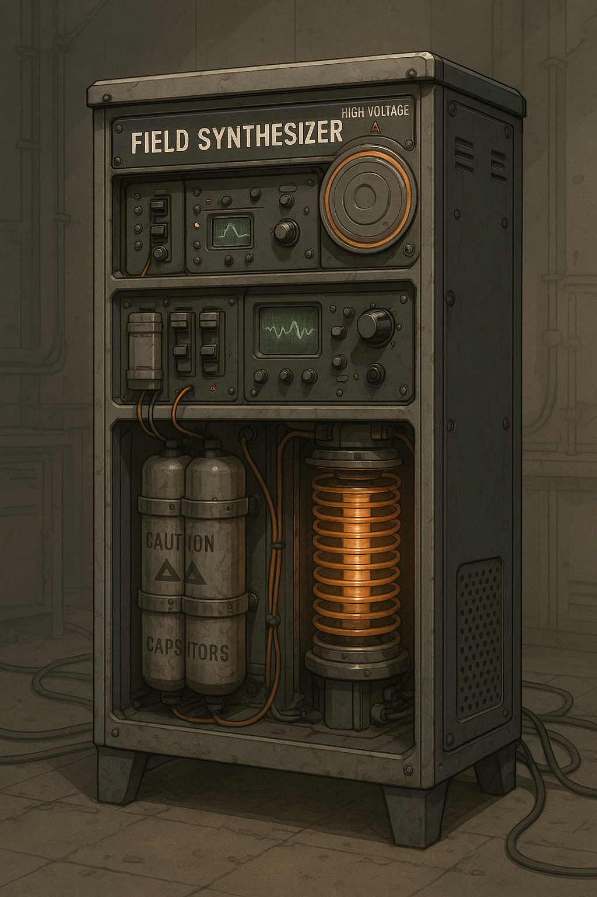
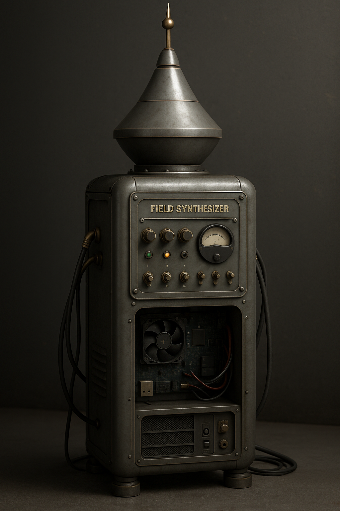

# Project 3: The Pillar (Field Synthesizer)

## 🧲 Description

A modular device designed to generate, blend, and modulate various field types: electric, magnetic, acoustic, plasma, gravitational analogs, and exotic derivatives. This system is conceived as a testbed for understanding and shielding complex field interactions (e.g., cosmic ray shielding, EM interference control), and possibly sensing/detecting anomalies via resonance or feedback.

Designed to act as both **Emitter** and **Receiver** across multiple field domains.

---

## 🔬 Scientific Basis

The device explores principles from:

* Electromagnetism (Faraday, Maxwell)
* Magnetohydrodynamics (MHD)
* Plasma confinement
* Acoustic cavitation and resonance
* Vacuum polarization and Casimir modulation
* Field interference and shielding (e.g., Van Allen analogs)
* Possibly cosmological background signal capture

---

## 🎯 Project Goals

* Create adjustable and interleaved fields (E/M/A)
* Detect anomalies or disturbances (e.g. ion wind, shielding capacity)
* Serve as base for experiments: quantum shielding, cosmic ray redirection, neutrino interactions
* Possibly induce effects that resemble synthetic gravity or field shaping

---

## 🧩 Modules (Categorized)

### 🔄 Core Control

* Central microcontroller (ESP32 / Teensy) w/ analog IO
* Multi-channel DAC/PWM modulation
* Safety interlocks & field isolation relays

### ⚡ Electric Field Emitter / Receiver

* Parallel plate capacitor module (variable spacing)
* Van de Graaff-style high-voltage node
* Sensitive capacitive sensors for reception

### 🧲 Magnetic Field Array

* Halbach or rotating rare-earth magnet segments
* Controlled electromagnets (H-bridge driven)
* Magnetic field probes (Hall sensors)

### 🔊 Acoustic Field Modulation

* Piezoelectric transducers (multifrequency array)
* Helmholtz resonator coupling chamber
* Sound pressure sensors (MEMS mic array)

### 🌌 Plasma Generation Module

* Low-pressure argon or neon chamber
* Tesla coil or flyback driver
* Optical & electrical sensors (plasma color, impedance)

### 🌀 Casimir & Vacuum Modulator

* Nanogap plate array with piezo-driven positioning
* Interferometric gap measurement
* Possibly biased by acoustic modulation (Vacuum Cymatics)

### 🛰️ Cosmic Ray / EM Interference Detector (Receiver only)

* Silicon PIN photodiode array
* Coincidence detection with lead shielding
* Spike detection correlator

### 🕳️ Synthetic Gravity Analogs

* Accelerometer + spinning magnetic disk (Mach effect emulator)
* Precessional torsion beam
* Gradient mapping array

### 🧊 Exotic Modules

* Time Crystal Oscillator (modulated driven capacitor array)
* Neutrino Wind Analyzer (radiation directionality meter)

---

## 🚀 Key Use Cases

| Function                    | Module(s)           | Purpose                                                        |
| --------------------------- | ------------------- | -------------------------------------------------------------- |
| Shielding                   | E/M/Plasma          | Mitigate cosmic ray or RF damage                               |
| Field Mapping               | Sensors + Emitters  | Study field interaction geometries                             |
| Vibration/Anomaly Detection | Acoustic / Magnetic | Resonant detection of nonlocal effects                         |
| Sensing Rare Events         | Cosmic + Vacuum     | Attempt capture of vacuum instability or directional radiation |
| Communication               | Acoustic + E/M      | Possibly prototype alternative signaling                       |

---

## ✅ Common Patterns Across Modules

* Modularity: Each field system is independently controlled.
* Feedback loop: All emitters pair with sensors.
* Cross-field interaction: Combos like EM + Acoustic or Plasma + Magnetic encouraged.
* Visual readout: LED spectrum bars or graphs for each channel.

---

## ⚖️ Safety

* High-voltage handling required
* Shielded enclosures for plasma and magnetic fields
* Active interlocks before switching modules

---

## 🔄 Future Extensions

* Add RF/microwave generation layers
* Explore ion propulsion offshoots
* Tie into force field habitat project as core emitter base

---

## 🛍️ Estimated Cost

* Baseline modular prototype: \~\$400–600
* With plasma & Casimir setups: \~\$1200+

# The Pillar: Safety and Power Overview

The **Pillar** is a modular, cabinet-sized device originally known as the *Field Synthesizer*. It is capable of emitting, detecting, and modulating multiple physical fields — from electrostatic to magnetic, plasma, and dielectric. Designed for DIY construction and experimentation, this document outlines essential safety considerations and power requirements.

---

## ⚠️ Safety and Function Table by Module

| #  | Module Name               | Type     | Risk Level   | What It's Good For                          | Origin Idea              |
| -- | ------------------------- | -------- | ------------ | ------------------------------------------- | ------------------------ |
| 1  | Capacitor Bank            | Emitter  | **High**     | Power burst, pulse discharge                | Classic HV experiments   |
| 2  | HF Oscillator Coil        | Emitter  | **Moderate** | EM manipulation, field synthesis            | Synthesizer Core         |
| 3  | Corona Discharge Ring     | Emitter  | **Moderate** | Ion generation, air conductivity            | Ionic thrust inspiration |
| 4  | Plasma Jet Emitter        | Emitter  | **High**     | Local field sculpting, propulsion test      | Plasma module            |
| 5  | Rotating Magnetic Array   | Dual     | **Low**      | Field modulation, magnetoacoustic effects   | Hamdi Ucar               |
| 6  | Dielectric Antenna Array  | Receiver | **Low**      | EM pattern sensing, signal pickup           | Fringe sensing module    |
| 7  | Capacitive Receiver Array | Receiver | **Low**      | Scalar field mapping, charge detection      | Synthesizer input module |
| 8  | Gravity Coil (Conceptual) | Emitter  | **Unknown**  | Simulated mass effects, experimental fields | Black hole detector idea |
| 9  | Time Crystal Oscillator   | Emitter  | **Moderate** | Field stability, entropy reference          | Capacitor time crystal   |
| 10 | Ion Wind Generator        | Emitter  | **Low**      | Air ionization, cooling, low thrust         | Ion propulsion concepts  |
| 11 | Magnetic Modulation Ring  | Emitter  | **Low**      | Controlled field layering                   | Synth module             |
| 12 | Capacitor Time Modulator  | Dual     | **Moderate** | Temporal interference test, spikes          | Synth expansion module   |

---

## ⚡ Power Requirements

| Feature                    | Approximate Value                 |
| -------------------------- | --------------------------------- |
| **Max Power Draw**         | 1200–1500W peak (all modules on)  |
| **Typical Operating Load** | \~800W average (partial modules)  |
| **Power Supply Option**    | ATX 1200W PSU or Bench Supply     |
| **Input Voltage**          | 110–120V (standard household AC)  |
| **Current Draw**           | \~12.5A max at 120V               |
| **Protection Recommended** | Fuse, Ground Fault Breaker (GFCI) |

---

## 🧷 Construction Tips

* Build inside an **acrylic/wooden cabinet with ventilation**.
* Use **insulated risers** and **non-conductive mounts** for spacing.
* Include **modular power switches** for each zone.
* Use a **grounding system** and **Faraday shielding** if near RF-sensitive equipment.

---

🔋 Practical Supply Options

Standard ATX Power Supply (1200W+)

— Common in enthusiast PC builds; reliable, modular.

Bench Power Supply + Step-Up Converter

— Ideal for modular testing of high-voltage parts.

UPS Backup or Inverter (Optional)

— Adds isolation + surge protection + safe shutdown.

House Circuit Compatibility

In North America: 1500W at 120V = 12.5A, so safely runs on one standard 15A outlet (avoid overload with other devices).

---

# Pillar v1: DIY Modular Fringe Science Platform (Detailed Module Table)

The Pillar is a modular, GPU-assisted platform capable of controlling, powering, and collecting data from a suite of fringe-scientific modules. Below is a breakdown of each integrated module, its purpose, required components, risks, and system connections.

---

## 🧠 Core Processing Unit

| Feature    | Description                                            |
| ---------- | ------------------------------------------------------ |
| Component  | NVIDIA RTX GPU (3090 or equivalent)                    |
| Function   | FFT, inference, control logic, real-time processing    |
| Interfaces | USB, PCIe, optional FPGA coprocessor                   |
| Notes      | Runs control models, analysis pipelines, visualization |

---

## 🔌 System I/O Backbone

| Feature   | Description                                              |
| --------- | -------------------------------------------------------- |
| Component | USB/Serial/Canbus Breakout Boards                        |
| Function  | Connects and powers modules, handles protocol conversion |
| Notes     | Can include I2C, SPI, UART hubs depending on need        |

---

## 🌐 Network + Telemetry

| Feature   | Description                                            |
| --------- | ------------------------------------------------------ |
| Component | WiFi card + SDR dongle (e.g. HackRF, RTL-SDR)          |
| Function  | Remote control, data capture, signal broadcast/receive |
| Notes     | External SDR antenna mounted outside shielded case     |

---

## ⚡ Power Supply System

| Feature   | Description                                        |
| --------- | -------------------------------------------------- |
| Component | Dual PSU (850W GPU, 600W bench adjustable)         |
| Function  | Isolated power to emitter modules                  |
| Notes     | Adjustable DC rails for variable field intensities |

---

## 🔲 Master Control + Display

| Feature   | Description                                |
| --------- | ------------------------------------------ |
| Component | OLED or eInk panel + rotary encoder        |
| Function  | Status, logs, tuning knobs for each module |
| Notes     | Can include touchscreen if needed          |

---

## MODULE INTEGRATION TABLE

| #  | Module Name                     | Type    | Emitter / Receiver | Purpose / Use Case                                  | Interfaces     | Power Source | Notes                              |
| -- | ------------------------------- | ------- | ------------------ | --------------------------------------------------- | -------------- | ------------ | ---------------------------------- |
| 1  | Magnetic Bound-State Driver     | Field   | Emitter            | Create strange field zones via rotating magnets     | PWM + relay    | DC motor     | Based on Hamdi Ucar's research     |
| 2  | Plasma Antenna / Emitter        | Plasma  | Both               | Modulated plasma burst communication or energy      | DAC + analog   | Bench PSU    | Must shield heat + voltage         |
| 3  | Coil Resonance EM Generator     | EM      | Emitter            | Generate standing EM field waves, magnetic shaping  | PWM driver     | Bench PSU    | Tesla-like coil output             |
| 4  | Passive Sensor Bank             | Sensor  | Receiver           | Pick up subtle shifts: EM, RF, thermal, acoustic    | I2C / SPI      | USB power    | Connects to AI for signal analysis |
| 5  | Entanglement Trigger Module     | Quantum | Emitter            | Launches SPDC crystal setup for photon entanglement | TTL / trigger  | Laser PSU    | For pairing with quantum radio     |
| 6  | Entangled Receiver Array        | Quantum | Receiver           | Detect polarization / coincidence counts            | ADC / USB      | USB power    | Requires synced clocks             |
| 7  | Field Envelope Actuator         | Electro | Emitter            | Create synthetic shielding field shapes             | DAC / H-Bridge | Bench PSU    | For ‘force field’ tests            |
| 8  | Field Resonance Chamber         | Hybrid  | Receiver           | Detect return fields or modulated patterns          | ADC / FFT GPU  | Shared PSU   | Uses Helmholtz coils or arrays     |
| 9  | Capacitor-Based Oscillator Ring | Energy  | Emitter            | Slow decay ring for pseudo-time-crystal experiments | RC switches    | Bench PSU    | Dangerous voltages                 |
| 10 | Analog Signal Mixer             | Comms   | Both               | Combines classical + entangled signal lines         | Analog mux     | USB power    | Syncs channels for analysis        |

---

**Pillar Module Details**

---

### 🧠 Core Processing Unit

| Component                               | Description                                              | Estimated Cost |
| --------------------------------------- | -------------------------------------------------------- | -------------- |
| NVIDIA GPU (e.g. RTX 3090)              | High-performance compute for signal processing, ML, FFTs | \$1,200        |
| Motherboard + CPU (Ryzen 7 or Intel i7) | Backbone for GPU and peripheral management               | \$600          |
| RAM (32–64 GB)                          | For data buffering and ML operations                     | \$150–\$300    |
| SSD (1TB NVMe)                          | Fast local storage for signal data                       | \$100          |
| Power Supply (850W Modular)             | Stable power for compute core                            | \$150          |
| Case (Rackmount or Tower)               | Housing + airflow for all core modules                   | \$150          |

Subtotal (Core Unit): **\$2,350–\$2,500**

---

### 🔌 I/O Hub + Sensor Integration

| Component                            | Description                                 | Estimated Cost |
| ------------------------------------ | ------------------------------------------- | -------------- |
| USB/SPI/UART Hub (multiport)         | For connecting sensors and emitters         | \$80           |
| GPIO + ADC/DAC Breakout Boards       | Read analog/digital inputs, control outputs | \$60           |
| SDR Dongle (e.g., HackRF or RTL-SDR) | Software-defined radio reception            | \$150–\$300    |
| Wi-Fi + Ethernet Modules             | Communication, telemetry                    | \$30           |
| OLED/Touch Display Panel             | Diagnostics, mode switching                 | \$40           |
| Mount Rails + Wiring Kits            | Modular sensor mounting and flexible wiring | \$100          |

Subtotal (I/O + Sensors Base): **\$460–\$610**

---

### 🌀 Field Synth + Emission Modules

| Module                                | Function                                       | Power Draw | Est. Cost |
| ------------------------------------- | ---------------------------------------------- | ---------- | --------- |
| Helmholtz Coils                       | Magnetic field shaping                         | 100–250W   | \$120     |
| Plasma Nozzles (miniature)            | Field ion emission                             | 300W       | \$200     |
| High Voltage Tesla-style Coil         | Voltage resonance modulation                   | 500W       | \$250     |
| Dielectric Plates + Frequency Driver  | Electrostatic lensing                          | 150W       | \$100     |
| Shielding Panels (Faraday + Mu-metal) | Field isolation & containment                  | —          | \$150     |
| Entanglement Input (SPDC module)      | Photon pair generation for quantum interaction | 50W        | \$300     |
| Audio-to-Field Transducers            | Convert audio modulations into fields          | 50W        | \$80      |
| Capacitive Time Oscillator            | Cyclic temporal modulator                      | 30W        | \$90      |

Subtotal (Field Synth Modules): **\$1,290**

---

### 🧃 Power System

| Component                               | Description                         | Estimated Cost |
| --------------------------------------- | ----------------------------------- | -------------- |
| Isolated Lab Power Supply (3–5 outputs) | Drive independent modules safely    | \$250          |
| Surge + Noise Filtering                 | Prevent cross-modulation and spikes | \$80           |

Subtotal (Power): **\$330**

---

### 📦 Final Cost Estimate Summary

| Category            | Range               |
| ------------------- | ------------------- |
| Core Unit           | \$2,350–\$2,500     |
| I/O + Sensors       | \$460–\$610         |
| Field Synth Modules | \$1,290             |
| Power System        | \$330               |
| **TOTAL**           | **\$4,430–\$4,730** |

> Note: DIYers could substitute lower-cost GPU (e.g., 3060 or used parts) to reduce budget by \$600–\$1,000.

Let me know if you want a bill of materials (BOM) spreadsheet or purchasing links for parts!

## 💬 Nickname

> "The Pillar" — a standalone artifact of protection, energy, and field synthesis. Home of the strange.

