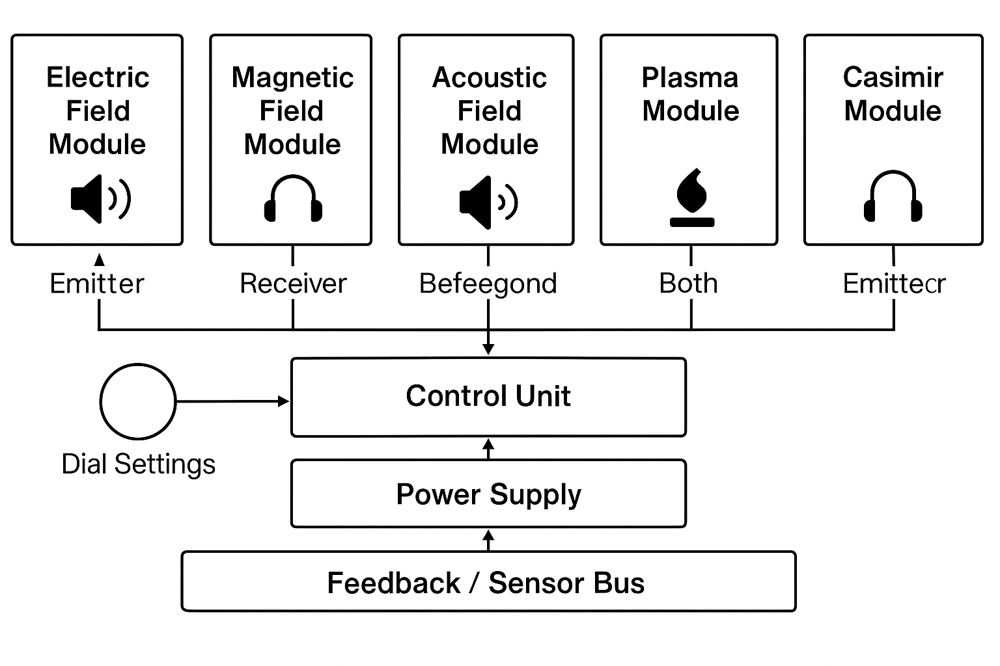

# Project 3: Field Synthesizer

## 🧲 Description

A modular device designed to generate, blend, and modulate various field types: electric, magnetic, acoustic, plasma, gravitational analogs, and exotic derivatives. This system is conceived as a testbed for understanding and shielding complex field interactions (e.g., cosmic ray shielding, EM interference control), and possibly sensing/detecting anomalies via resonance or feedback.

Designed to act as both **Emitter** and **Receiver** across multiple field domains.

---

## 🔬 Scientific Basis

The device explores principles from:

* Electromagnetism (Faraday, Maxwell)
* Magnetohydrodynamics (MHD)
* Plasma confinement
* Acoustic cavitation and resonance
* Vacuum polarization and Casimir modulation
* Field interference and shielding (e.g., Van Allen analogs)
* Possibly cosmological background signal capture

---

## 🎯 Project Goals

* Create adjustable and interleaved fields (E/M/A)
* Detect anomalies or disturbances (e.g. ion wind, shielding capacity)
* Serve as base for experiments: quantum shielding, cosmic ray redirection, neutrino interactions
* Possibly induce effects that resemble synthetic gravity or field shaping

---

## 🧩 Modules (Categorized)

### 🔄 Core Control

* Central microcontroller (ESP32 / Teensy) w/ analog IO
* Multi-channel DAC/PWM modulation
* Safety interlocks & field isolation relays

### ⚡ Electric Field Emitter / Receiver

* Parallel plate capacitor module (variable spacing)
* Van de Graaff-style high-voltage node
* Sensitive capacitive sensors for reception

### 🧲 Magnetic Field Array

* Halbach or rotating rare-earth magnet segments
* Controlled electromagnets (H-bridge driven)
* Magnetic field probes (Hall sensors)

### 🔊 Acoustic Field Modulation

* Piezoelectric transducers (multifrequency array)
* Helmholtz resonator coupling chamber
* Sound pressure sensors (MEMS mic array)

### 🌌 Plasma Generation Module

* Low-pressure argon or neon chamber
* Tesla coil or flyback driver
* Optical & electrical sensors (plasma color, impedance)

### 🌀 Casimir & Vacuum Modulator

* Nanogap plate array with piezo-driven positioning
* Interferometric gap measurement
* Possibly biased by acoustic modulation (Vacuum Cymatics)

### 🛰️ Cosmic Ray / EM Interference Detector (Receiver only)

* Silicon PIN photodiode array
* Coincidence detection with lead shielding
* Spike detection correlator

### 🕳️ Synthetic Gravity Analogs

* Accelerometer + spinning magnetic disk (Mach effect emulator)
* Precessional torsion beam
* Gradient mapping array

### 🧊 Exotic Modules

* Time Crystal Oscillator (modulated driven capacitor array)
* Neutrino Wind Analyzer (radiation directionality meter)

---

## 🚀 Key Use Cases

| Function                    | Module(s)           | Purpose                                                        |
| --------------------------- | ------------------- | -------------------------------------------------------------- |
| Shielding                   | E/M/Plasma          | Mitigate cosmic ray or RF damage                               |
| Field Mapping               | Sensors + Emitters  | Study field interaction geometries                             |
| Vibration/Anomaly Detection | Acoustic / Magnetic | Resonant detection of nonlocal effects                         |
| Sensing Rare Events         | Cosmic + Vacuum     | Attempt capture of vacuum instability or directional radiation |
| Communication               | Acoustic + E/M      | Possibly prototype alternative signaling                       |

---

## ✅ Common Patterns Across Modules

* Modularity: Each field system is independently controlled.
* Feedback loop: All emitters pair with sensors.
* Cross-field interaction: Combos like EM + Acoustic or Plasma + Magnetic encouraged.
* Visual readout: LED spectrum bars or graphs for each channel.

---

## ⚖️ Safety

* High-voltage handling required
* Shielded enclosures for plasma and magnetic fields
* Active interlocks before switching modules

---

## 🔄 Future Extensions

* Add RF/microwave generation layers
* Explore ion propulsion offshoots
* Tie into force field habitat project as core emitter base

---

## 🛍️ Estimated Cost

* Baseline modular prototype: \~\$400–600
* With plasma & Casimir setups: \~\$1200+

> 📸 Add schematics later showing modular rack system
